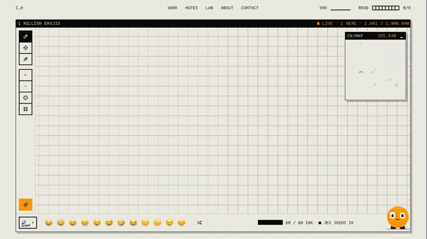

<p align="center"></p>

# 1 Million Emojis

A shared 1,000 × 1,000 emoji canvas where humans paint and Jev paints alongside them.

**Live:** [chriswijnia.com/lab/emoji](https://chriswijnia.com/lab/emoji). No account: pick an emoji and drag. You have
sixty cells of ink, and it comes back one a second. Everyone's strokes arrive live.

**What Jev does.** After each stroke, [TypeSafe AI](https://docs.typesafe.ai)'s Jev, a System One model, answers one
request. It chooses from a typed set of options: emoji that share keywords with what is painted around the stroke,
each in a place named against it ("above the line", "at its end", "inside the loop"). It also answers a yes/no:
is the stroke unfinished? When it is sure, it closes the loop or carries the line on instead. Its pick is drawn from
its probabilities, wider the less sure it is, and its top candidates flash on the canvas before the pick lands.

**What goes to Jev.** Only the drawing: the stroke's shape and where it ends, the emoji around it by name, and a small
text picture of the cells nearby. Nothing about who painted it. Calls go through Vercel's AI Gateway first, TypeSafe
directly as the fallback, and each visitor has a rate limit and the site a daily spend cap.

<p align="center"></p>

| Package | What it is | Licence |
| --- | --- | --- |
| [`packages/emoji`](packages/emoji) | The canvas's rules (grid, tiles, ink), the palette with names, groups and keywords, and Jev joining a stroke | MIT |
| [`packages/jev`](packages/jev) | A small Jev client: the Vercel AI Gateway first, TypeSafe directly as the fallback, answers checked, cost reported | MIT |

```sh
npm install
npm test          # the packages' unit tests (no Jev calls)
npm run typecheck
```

This repository is a mirror: it is copied from the site's monorepo on every change there, so pull requests are read
but applied upstream.
